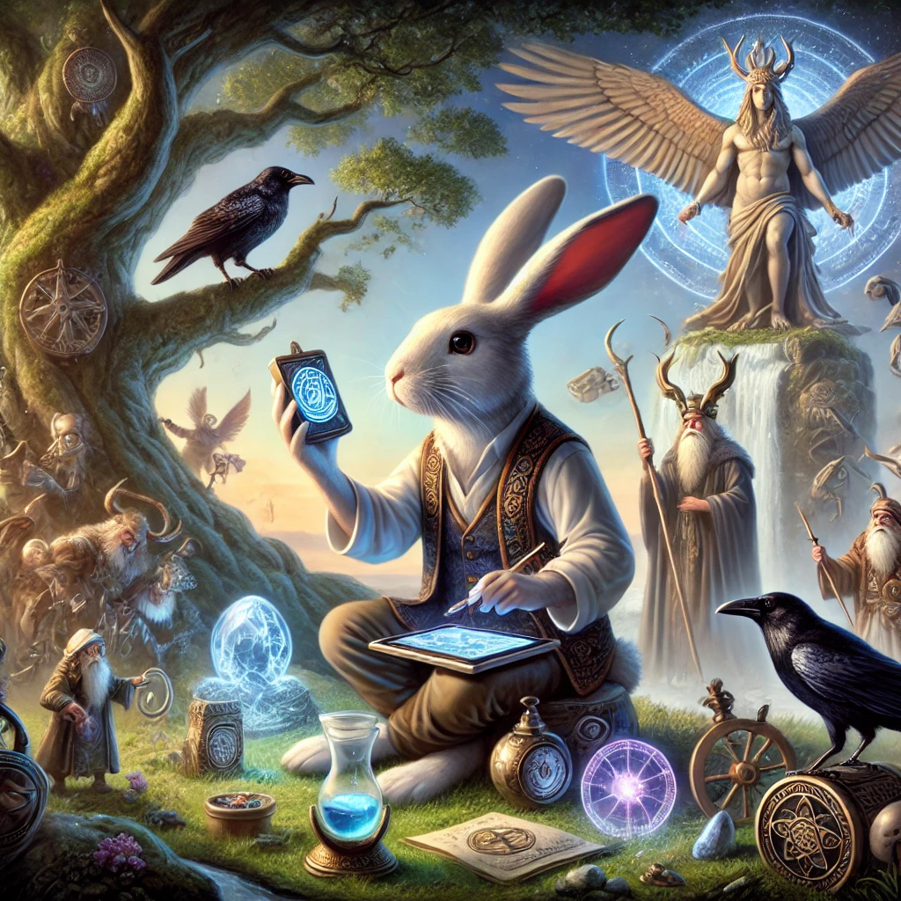

[//]: # ([![CodeQL Quality Scan]&#40;https://github.com/Gervi-Hera-Vitr/sindri-labs/actions/workflows/codeql.yml/badge.svg&#41;]&#40;https://github.com/Gervi-Hera-Vitr/sindri-labs/actions/workflows/codeql.yml&#41; )
[//]: # ([![Build action checks on Push]&#40;https://github.com/Gervi-Hera-Vitr/sindri-labs/actions/workflows/push-gates.yaml/badge.svg&#41;]&#40;https://github.com/Gervi-Hera-Vitr/sindri-labs/actions/workflows/push-gates.yaml&#41;)
[//]: # ([![Prune Caches by Branch]&#40;https://github.com/Gervi-Hera-Vitr/sindri-labs/actions/workflows/cache-prune.yaml/badge.svg&#41;]&#40;https://github.com/Gervi-Hera-Vitr/sindri-labs/actions/workflows/cache-prune.yaml&#41; )
[//]: # ([![Manage Stale Issues and Pull Requests]&#40;https://github.com/Gervi-Hera-Vitr/sindri-labs/actions/workflows/stale.yml/badge.svg&#41;]&#40;https://github.com/Gervi-Hera-Vitr/sindri-labs/actions/workflows/stale.yml&#41;)
[//]: # ([![Label Pull Request]&#40;https://github.com/Gervi-Hera-Vitr/sindri-labs/actions/workflows/label.yml/badge.svg&#41;]&#40;https://github.com/Gervi-Hera-Vitr/sindri-labs/actions/workflows/label.yml&#41;)
[//]: # ([![Greetings and Welcome!]&#40;https://github.com/Gervi-Hera-Vitr/sindri-labs/actions/workflows/greetings.yml/badge.svg&#41;]&#40;https://github.com/Gervi-Hera-Vitr/sindri-labs/actions/workflows/greetings.yml&#41; )

> [Vitr`î Labs Site](https://gervi-hera-vitr.github.io/sindri-labs/ "Gervi Hî Vitr Labs") 🚧 <- not ready yet
 

## Welcome, Dear Friend

This [Sindri](https://en.wikipedia.org/wiki/Sindri_(mythology)) Workshop is also our place of posterity.  
This is a hands-on learning trail by and for our [Munchkins](http://www.catb.org/esr/jargon/html/M/munchkin.html "Munchkins") (CatB HTTP).  
Munchkins experiment with AI in their own [Gervi Héra Vitr](https://github.com/Gervi-Hera-Vitr "Gervi-Hera-Vitr") community,  
tracked by [Gervi Héra Viskr Learning Trails](https://github.com/orgs/Gervi-Hera-Vitr/projects/1 "Héra gains Viskr") project, and supervised by  
adult hackers of [AGAIN](https://github.com/Gotham-Village "AGAIN as Gotham Village") at [Mímis Gildi](https://github.com/Mimis-Gildi "Mimis-Gildi") tracked by [Mímis Publishing](https://github.com/orgs/Mimis-Gildi/projects/1 "Mimis-Publishing").

### Everyone learning is Welcome!

**Learning is the sacred core value of [Mímir](https://en.wikipedia.org/wiki/M%C3%ADmir "Mímir, the Norse god of knowledge").**

_Come, have a drink from [Yggdrasil](https://en.wikipedia.org/wiki/Yggdrasil "Yggdrasil, the well of life") with us._ 😀

-- Captain and R!dd13r 
2024-10-27

See our security policy [here](https://github.com/Gervi-Hera-Vitr/sindri-labs/security/policy "Security Policy").

### Contents

**The curriculum and the learning trail are structured hierarchically as follows:**

- [**administration**](./administration) - _**Run The School**_ resources necessary for operating the school:
  - Governance, Management and State Requirements;
  - Calendars and Schedules; Administrative record keeping;
  - Strategic Study Planning: Didactic plan (dedicated project).
- [**assessments**](./assessments) - Tracking and Reporting of Student Progress and Performance.
- [**curriculum**](./curriculum) - _**Planned Learning Materials**_: exact content of the **hands-on** learning;
   - **Core Philosophy** - student must master the skills of discovering facts, building arguments, and drawing conclusions;
   - **Granularity** - learning materials covered here must be exact;
   - **Execution** -  _there should never be top-down teaching of any kind_ -  _**all learning is ALWAYS collaborative!**_
- [**journey**](./journey) - _**Philosophical Foundation**_: high-level governance of the **hands-on** learning **journey**;
  - **ToDo**: _not fully committed to the learning trail yet - too few iterations_;
  - **For teachers**: a book or a guide encapsulating the educational program;
  - **For students**: a structure of reference on trails within the journey;
  - **Artifact**: a publication built and deployed with Gradle and AsciiDoc.
- [**labs**](./labs) -  The **hands-on** learning **labs** - _the most important part of the school program_;
  - **For teachers**: this is a place to collaborate with your student by pair-programming;
  - **For students**: this is Your Place! To play and to learn by doing.
- [production](./production) - The most important student deliverables: real world applications;
  - Consists of Git Modules which are real life application projects linked by students;
  - Performance of products in production overrides any other scoring criteria at school.

**Supporting materials, modules, and artifacts:**

- [.run](./.run) - Shared project run configurations: useful stuff.
- [**docs**](./docs) - Documentation, Tutorials, and Onboarding Guide for teachers and students;
  - ToDo: placeholder waiting for consumers, contributors, and maintainers;
  - **For teachers**: instructions on how to `fork` and set up own school program;
  - **For students**: mechanical and technical instructions such as IDE setup, etc.;
  - **Artifact**: inline project-bound documentation.
- [gradle](./gradle) - Gradle Wrapper files, supporting build.
- [lab-ux-ktor](./lab-ux-ktor/README.md) - _**future**_ home and demo for shared labs (Gradle and Ktor subproject).
- [local](./local) - Fluent local setup instructions for IDEs used in labs and production applications.
- [site](./site) - Public home page for the school published with Jekyll and GitHub Pages.
- [src](./src) - Source code for the support of the school program operations at the root of the repository.
- [.github](./.github) - GitHub actions and workflows are actively using these scripts.

**Technical and mechanical modules for the school assets:**

- [.github](./.github) - GitHub actions and workflows; this needs to be here.
- [.idea](./.idea) - JetBrains IDE files, normally excluded, kept as an example for styles, etc.
- [.kotlin](./.kotlin) - Kotlin files, normally excluded, kept as an example for ML bootstrap, etc.
- [docs](./docs) - Documentation, Tutorials, and Onboarding Gide; **ToDo**

**Transient folders that should not be committed:** _git-excluded and removed on cleanup_.

- [.gradle](./.gradle) - software project definition tool working folder.
- [build](./build) - software project build folder - _**always**_ delete it on cleanup.

> See [security](./SECURITY.md) for the factor twelve regular maintenance links.

## For My Munchkins

- [_**Give Me 23 Minutes And I'll Destroy Your Laziness Forever!**_](https://youtu.be/EkDxsQRbIwo)
  - Engage → Struggle → Release → Flow → Recover -- works
  1. Clear goal - crazy specific;
  2. Break down to pulp;
  3. Balance LOLs - (scope, complexity, time, energy);
  4. Bypass the wall (rejection);
  5. EAT THAT LOL.
- [Productivity Game](https://www.youtube.com/@ProductivityGame "Productivity Game")
- [LITTLE BIT BETTER](https://www.youtube.com/@littlebitbetter7 "LITTLE BIT BETTER")

## Code Quality and Validation

## DevOps, MLOps, and CICD Pipelines

