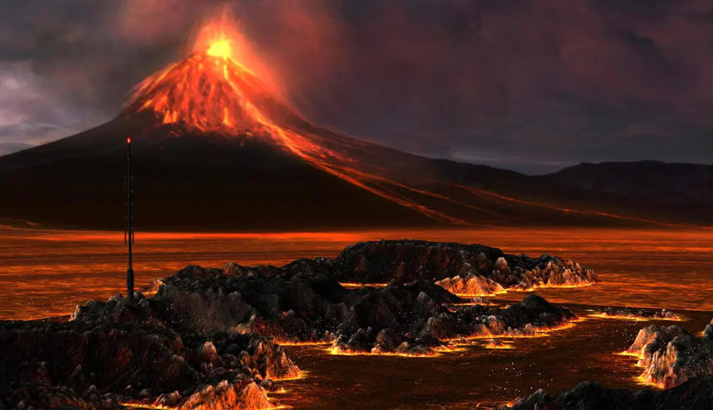

= How a Volcano Once Blocked Out the Sun (1816: The Year Without a Summer)
Anton Kuhay <mamin.snook@gmail.com>
v3.0, July 29, 2022
:doctype: article
:toc: left
:icons: font
:imagesdir: images

== Introduction of calamity
The year 1816 is often remembered as The Year Without a Summer, a time of *extreme* weather anomalies that led to global crop failures, food shortages, and social unrest. The root cause? +
The massive eruption of *Mount Tambora* in April 1815, one of the most powerful volcanic eruptions in recorded history. This catastrophic event sent enormous amounts of volcanic ash and sulfur dioxide into the atmosphere, dramatically altering the Earth’s climate for over a year.

== The Eruption of Mount Tambora(April 1815)

*Mount Tambora*, located in present-day Indonesia, erupted with an estimated *Volcanic* *Explosivity Index* *(VEI)* of 7, making it the largest eruption in at least 1,300 years. The explosion ejected about *100 cubic kilometers* of volcanic material into the atmosphere, killing tens of thousands in the immediate aftermath. However, the most significant and far-reaching consequences were atmospheric:

-A vast cloud of ash and sulfur dioxide spread across the globe, blocking sunlight.+

-Global temperatures dropped by an estimated *0.4–0.7°C (0.7–1.3°F)* over the next year.+

-Acid rain and ashfall disrupted agriculture and ecosystems.

== 1816: A year without a summer
As a result of Tambora’s eruption, the Northern Hemisphere experienced a dramatic *climate shift in 1816, leading to unseasonably cold temperatures, failed harvests, and widespread famine.* Some of the most significant effects were:

-*Frost in Summer*: Snow fell in *June* in parts of New England and Canada, and frosts occurred as far south as Virginia. +

-*Crop Failures*: Europe and North America saw wheat, corn, and other crops fail, causing food shortages and skyrocketing prices. +

-*Famine and Disease*: With food scarcity came malnutrition, and diseases like *typhus and cholera spread rapidly.* +

-*Mass Migration*: Many Americans, unable to farm, moved westward in search of better conditions, speeding up U.S. expansion. +

== Cultural and Scientific Advancements
The Year Without a Summer also had unexpected cultural effects:

-*Mary Shelley’s Frankenstein* – In 1816, a group of writers, including Mary Shelley, were trapped indoors due to the gloomy weather while vacationing in Switzerland. This eerie atmosphere inspired the creation of Frankenstein, a story that would become one of the most famous Gothic novels of all time.

-*Invention of the Bicycle* – Crop failures led to the death of many horses, prompting German inventor *Karl Drais* to develop the *Laufmaschine*, an early prototype of the modern bicycle.

== A warning from history
The 1816 climate crisis is a reminder of how *volcanic activity can significantly impact global weather patterns.* While modern science allows us to predict and mitigate some effects, a similar eruption today would still pose severe risks to global food supply and economies.

== conclusion
The Year Without a Summer was a direct result of the Mount Tambora eruption, demonstrating how a single geological event can reshape human history. From global famine to literary inspiration, its effects were profound and far-reaching. Understanding these historical climate anomalies can help us prepare for future environmental disruptions.
