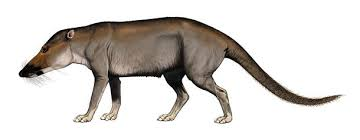
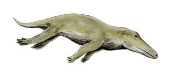
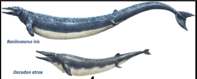

Whales who are mammals evolved from another mammal called Pakicetus:  around 50 million years ago.
Pakicetus's were like wolves and were around the same size, besides the fact
that it had bone-like structures specifically in the ears that aloud it to hear underwater, but it mostly hunted on land near the water.
But after a few million years, ~ 49 - 47 million years ago they evolved into Ambulocetus and Rodhocetus:    who were land/water mammals around the size of a large 
otter to a crocodile. They had strong limbs and powerful tail's for better water propulsion and probably lives in
rivers and costal areas, hunting in water. Around 40 - 45 million years ago They made the transition into a fully aquatic animal called The Dorudon and the Basilosaurus:  who had 
long snake like bodies, being 18-60 feet long with flippers instead of limbs and were most likely ancestors to modern whales. 34 million years ago we go our very first glimpse of a Modern whales as
2 major groups emerged: Toothed whales(Odonteceti) which includes dolphins, orcas and sperm whales that all hunted for fish and squid evolving echolocation. Then we had the Baleen Whales(Mysticeti) which included blue whales, humpback whales and right whales who hunted krill and small marines organisms.
Currently today, whales closest relatives are a group of hoofed mammals called Artiodactyls that includes deer, pigs, and hippos. The closest living relatives of whales are hippos. Genetic evidence supports that whales and hippos share a common ancestor that lived around 55 million years ago.
Sources: https://us.whales.org/whales-dolphins/how-did-whales-evolve/#:~:text=WDC%20experts%20explain.,%2C%20deer%2C%20pig%20and%20cow.
https://evolution.berkeley.edu/what-are-evograms/the-evolution-of-whales/
https://phys.org/news/2005-01-scientists-link-whale-closest-relative.html

