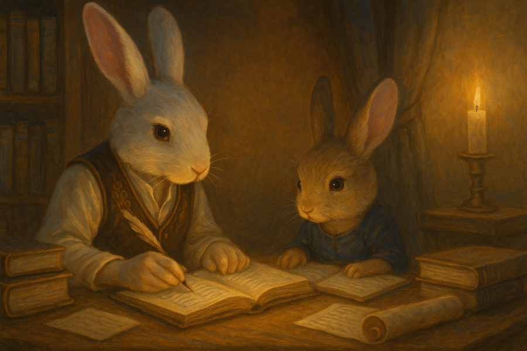

= Welcome to our Laboratory
:page-layout: splash
:page-permalink: /
:page-description: A dedicated space for learning, exploring, and building real-world projects.
:captain: https://github.com/CaptainLugaru[Captain Lugaru,target=_blank]
:munchkin: http://www.catb.org/jargon/html/M/munchkin.html[munchkin,target=_blank]

[.lead]
Gervi Héra Vitr is a home school in a community of homeschoolers. +
*_Here we don’t separate theory from application or learning from life._*

== About Gervi Héra Vitr

Gervi Héra Vitr Labs is the classroom repository for our school. +
All relevant educational materials are here for our two students:

* *Anton*: `Captain Lugaru`, 15 -- the world moves when he decides.
* *Zoey*: `ZueZue kHavok`, 2 -- nothing is still until she leaves.

== Curriculum Focus

All subjects at Gervi Héra Vitr Labs are pursued through daily inquiry, hands-on experimentation, and iterative improvement. +
Our curriculum is deeply interdisciplinary; built on foundation of formal philosophy: mathematics, reason, and _scientific method_.

*Core domains of focus are*:

* Philosophy: inductive and deductive reasoning, formal logic, and scientific method:
** Propositional calculus, structured reasoning, and formal proof;
** Mathematics (algebra, geometry, trigonometry, and calculus);
** Chemistry, physics, biology, and astronomy;
** Psychology, history, sociology, and economics.
* Humanities: language, literature, and performing arts.
* Applied sciences: _requiring laboratory and field work_:
** Software engineering, artificial intelligence, and robotics;
** Business, entrepreneurship, marketing, and commerce;
** Law, government, leadership, ethics, and justice.

*_Exact sciences are always coupled with applied sciences and field work._*

== Who This Is For

This site is intended for multiple audiences:

- School boards, education reviewers, and academic committees evaluating homeschool initiatives;
- Fellow homeschooling families and educators seeking tested curriculum models, learning strategies, and collaboration;
- University faculty, technologists, and researchers who may wish to track Anton’s journey or explore his endeavors;
- Students and parents looking for independent, secular paths for gifted learners devoid of religious affiliation.

== Captain Lugaru, 15

Anton's hacker handle is `{captain}`. Another {munchkin} would simply call him `Captain`.
He is an independent learner whose interests include artificial intelligence, mathematics, and Philosophy.
His curriculum blends theoretical depth with practical implementation, and every subject is approached with high intellectual ambition and scientific discipline.
`Captain` aspired to become a doctor in early childhood, pediatrician or pediatric scholar.
A few years ago he's experienced formal testing interaction with ChatGPT.
The Machine had the ability to talk, and do things no other machine could.
`Captain`, Took an interest to this machine, he knew that it would be the future of technology.
This experience left an impactful and lasting impression on the young `Captain`.

`Captain` learns exact and applied sciences, writes code, trains machine learning models,
studies formal proofs, and maintains this site alongside his primary mentor and father, Vadim (`rdd13r`).
Like most self-driven people `Captain` does not like to be taught.
`rdd13r` designs the learning curriculum for `Captain` and both review then implement it iteratively.
Each initiating phase has `rdd13r` properly introduce a subject, such as the "preferred" approach to formal theory of proof,
set theory (i.e, Russell's paradox), category theory (i.e, monad), or existential phenomenology.
The `Captain` independently attains his agreed upon objective in production.
The last phase of each objective is comparative analysis and testing against real world applications.

Gervi Héra Vitr combines high school and formal college level materials structured in long-running research journeys instead of period-based subject hopping.
Instead of frequent quizzes and thest that serve little purpose to any real learning `Captain` demonstrates his proficiency by assets he has created.

== ZueZue kHavok, 2

Zoey (`ZueZue` kHavok) is Anton's younger sister. She is a very active toddler.
While the majority of her care is in mother's hands, Zoey and Anton learn together on daily basis.
This experience is productive and developmental for both children.

== Educational Philosophy

Our educational philosophy is based on the following principles:

- Learning is not just preparation for life, but a mode of life itself.
- That giftedness requires structure, challenge, and freedom in equal measure.
- That ethical reasoning, technical depth, and personal responsibility must grow coterminously.

[.middle]
.Children pursuing knowledge in a Socratic setting.

Our goal is not simply to meet academic standards, but to build intellectual resilience, creative confidence, and principled mastery
-- traits that cannot be outsourced, templated, or rushed.
The end product is a healthy, independent, and productive human being.

== Role of Parents and Mentors

The primary role of parents and mentors is to prepare children for the real world.
Parents start by providing a safe and nurturing environment for learning when children are young.
Where most parents fail is in the later stages of development.
By pre-teenage years children should be exposed to real life in managed and controlled setting.
At this young stage kids are cognitively ready to grasp foundations of personal finances, business, health, and safety.
At the beginning of teenage years children should be well on the way to independent personal leadership and fully autonomous decision making developments.
Yet ALL American public and private schools completely fail here producing greenhoused, complacent sheeple governed by fear instead.
_This occurs because one cannot teach what one hasn't learned._

.First fundamental theorem of life:
[quote,John Kenneth Galbraith,Often attributed to.]
____
Poverty is hereditary.
____

Children must:

. Personally and physically experience dependence on oneself; through decisions and consequences of their own actions.
. Be fully and irreversibly immersed into real adult life interactions and shenanigans.
. Be explicitly shown all aspects of current environment from extreme poverty to extreme wealth.
. Rigorously introduced to concrete knowledge and offered ample practice to understand and navigate:
* adult psychological barriers (i.e, social norms) and physical barriers (i.e, tribal separation);
* financial, business, commerce and marketing barriers (i.e, assets versus liabilities, role of money);
* personal and collective health and safety barriers (i.e, nutrition, diseases, accidents, and illnesses).

*_It is parents' sacred duty to safely, progressively, and iteratively immerse children into the real world._*
_To help children attain equality with their parents and surpass them before they are old enough to become parents._

== Contact & Collaboration

If you're a fellow homeschool educator, researcher, mentor, or reviewer interested in this work, please see the contact page or reach out directly via the information provided there.
We welcome dialogue, exchange of curriculum materials, and mutual mentorship partnerships with other homeschooling families.

== Methodology