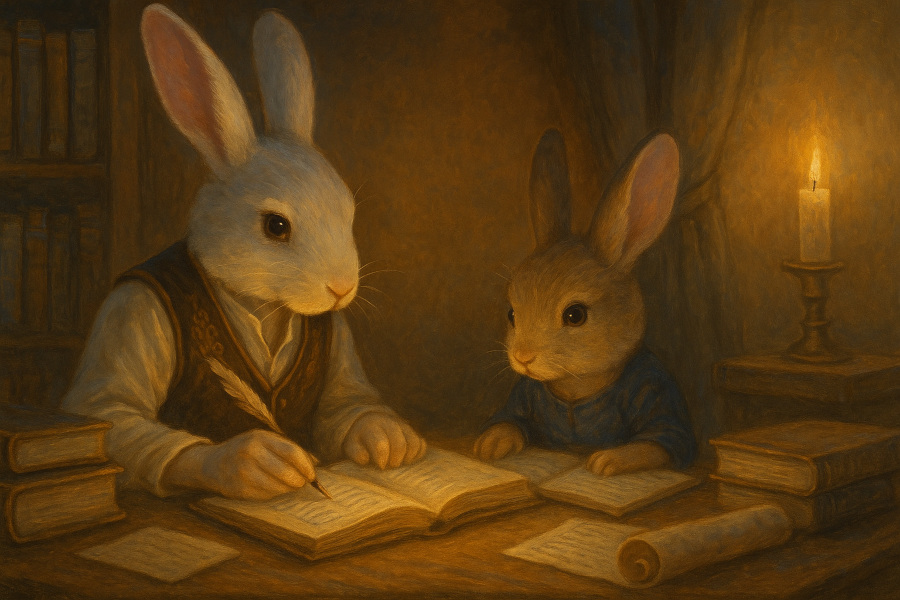

---
header:
  overlay_image: assets/images/banner-anton.jpg
  overlay_filter: 0.2
  caption: ...where ancient wisdom meets modern fluffle innovations
  actions:
    - label: "People of Science"
      url: /people/
    - label: "Literature"
      url: /literature/
    - label: "Philosophy"
      url: /philosophy/
    - label: "Mathematics"
      url: /mathematics/
    - label: "Science"
      url: /science/
    - label: "Project"
      url: https://github.com/orgs/Gervi-Hera-Vitr/projects/1/views/1
---
= Welcome to our Laboratory
:page-layout: home
:page-permalink: /
:page-classes: wide
:page-excerpt: introduction to our forge and core values
:page-description: A dedicated space for learning, exploring, and building real-world projects.
:munchkin-fn: footnote:munchkin[Jargon File entry on {munchkin}]

:proof-theory: https://en.wikipedia.org/wiki/Proof_theory[Proof theory,window=_blank]
:proof-theory-fn: footnote:[Wikipedia article on {proof-theory}]

:set-theory: https://en.wikipedia.org/wiki/Set_theory[Set theory,window=_blank]
:set-theory-fn: footnote:[Wikipedia article on {set-theory}]

:russells-paradox: https://en.wikipedia.org/wiki/Russell%27s_paradox[Russell's paradox,window=_blank]
:russells-paradox-fn: footnote:[Wikipedia article on {russells-paradox}]

:category-theory: https://en.wikipedia.org/wiki/Category_theory[Category theory,window=_blank]
:category-theory-fn: footnote:[Wikipedia article on {category-theory}]

:monad: https://en.wikipedia.org/wiki/Monad_(category_theory)[Monad (category theory),window=_blank]
:monad-fn: footnote:[Wikipedia article on {monad}]

:existentialism: https://en.wikipedia.org/wiki/Existentialism[Existentialism,window=_blank]
:phenomenology: https://en.wikipedia.org/wiki/Phenomenology_(philosophy)[Phenomenology,window=_blank]
:existential-phenomenology-fn: footnote:[Wikipedia articles on {existentialism} and {phenomenology}]

:socratic-method: https://en.wikipedia.org/wiki/Socratic_method[Socratic method,window=_blank]
:socratic-method-fn: footnote:[Wikipedia article on {socratic-method}]

:socratic-setting-fn: footnote:[A small-group dialogic setting modeled on Socrates's elenctic questioning, where the teacher draws understanding out of the student through guided inquiry rather than direct instruction.]

[.lead]
Gervi Héra Vitr is a home school in a community of homeschoolers. +
*_Here we don’t separate theory from application or learning from life._*

== About Gervi Héra Vitr

Gervi Héra Vitr Labs is the classroom repository for our school. +
Relevant educational materials for our two students are here:

{captain}, 16 -- "the world moves when he decides it does, never before"::
Pre-College preparatory work.

ZueZue, 3 -- "nothing touches the floor until she leaves; then stuff rains down"::
Potty Training 111.

== Curriculum Focus

All subjects at Gervi Héra Vitr Labs are pursued through daily inquiry, hands-on experimentation, and iterative improvement.
Our curriculum is deeply interdisciplinary, built on the foundation of formal philosophy: mathematics, reason, and _scientific method_.

*Core domains of focus are*:

* Philosophy, _inductive_ and _deductive reasoning_, formal logic, and *_scientific method_*:
** Propositional calculus, structured reasoning, and *formal proof*;
** Mathematics, including algebra, geometry, trigonometry, and calculus;
** Natural science, chemistry, physics, biology, and astronomy.
* Social science, psychology, history, anthropology, sociology, arts, and economics:
** Humanities, language, literature, dance, music, theater, and film;
** Law, government, leadership, ethics, political science, and justice.
* Applied sciences to generate testable assets proving the theory above:
** Software engineering, artificial intelligence, and robotics;
** Business, entrepreneurship, marketing, and commerce.

*_Exact sciences are always coupled with applied sciences and field work._*

== Who This Is For

This site is intended for multiple audiences:

- School boards, education reviewers, and academic committees evaluating homeschooling;
- Fellow homeschoolers and educators seeking models, learning strategies, and collaboration;
- University faculty, technologists, and researchers tracking student journeys and endeavors;
- Students and parents of gifted learners on independent secular paths unaffiliated with religion.

== Captain, 16

Captain's hacker handle is `Cpt. Lugaru`.
Another munchkin{munchkin-fn} would simply call him Captain.
He is an independent learner whose interests include artificial intelligence, mathematics, and philosophy.
His curriculum blends theoretical depth with practical implementation,
and every subject is approached with high intellectual ambition and scientific discipline.
Captain aspired to become a doctor in early childhood, pediatrician, or pediatric scholar.
A few years ago he experienced formal testing interaction with ChatGPT.
The Machine could speak-and act-in ways no other ever had.
Captain took an interest in the machine; he knew that it would be the future of technology.
This experience left an impactful and lasting impression on the young Captain.

Captain learns exact and applied sciences, writes code, trains machine learning models,
studies formal proofs, and maintains this site alongside his primary mentor and father, {rdd13r}.
Like most self-driven people, Captain does not like to be taught.
DaiDai designs the learning curriculum for Captain, and both review then implement it iteratively.
Each new subject begins with DaiDai properly introducing the topic, such as the "preferred" approach to formal theory of proof{proof-theory-fn},
set theory{set-theory-fn} (i.e., Russell's paradox{russells-paradox-fn}), category theory{category-theory-fn} (i.e., monad{monad-fn}), or existential phenomenology{existential-phenomenology-fn}.
The learner then delivers the "study-objective" in production and completes comparative analysis against real-world applications.
Closing the "study-objective" requires testing against real-world applications.

Gervi Héra Vitr blends high school and college-level material into long-term research journeys -- avoiding subject-hopping,
frequent quizzes, and tests that do little to deepen real learning.

== ZueZue, 3

ZueZue is Captain's younger sister.
She is a very active toddler.
While her care is primarily in their mother's hands, ZueZue and Captain learn together daily.
Both gain from the time they spend learning together.

== Educational Philosophy

Our educational philosophy is based on the following principles:

- Learning is not just a preparation for life, but a mode of life itself.
- Giftedness requires structure, challenge, and freedom in equal measure.
- Ethical reasoning, technical depth, and personal responsibility must grow coterminously.

[.middle]
.Children pursuing knowledge in a Socratic{socratic-method-fn} setting{socratic-setting-fn}.

Our goal is not simply to meet academic standards, but to build intellectual resilience,
creative confidence, and principled mastery
-- traits that cannot be outsourced, templated, or rushed.
The outcome is a human being ready to build, care, and lead.

== Role of Parents and Mentors

The primary role of parents and mentors is to prepare children for the real world.
Parents start by providing a safe and nurturing environment for learning when children are young.
Most parents falter in the later stages.
By pre-teenage years children should be exposed to real life in a managed and controlled setting.
At this young stage kids are cognitively ready to grasp the foundations of personal finances, business, health, and safety.
At the beginning of teenage years, children should be well on the way to independent personal leadership
and fully autonomous decision-making.
Yet typical American public schools and even some private schools tend to fail developing personal leadership;
producing instead insulated, risk-averse children governed by institutional fear and blind conformance.
_This occurs because one cannot teach what one hasn't learned._

.First fundamental theorem of life:
[quote,John Kenneth Galbraith,Often attributed to.]
____
Poverty is hereditary.
____

{zwsp}

*Children grow by:*

. Personally _experiencing_ dependence on oneself, through decisions and consequences of their own actions; incrementally and introspectively.
. Being fully immersed into real adult life interactions, business dealings, and shenanigans: for example, consequence of losing customers.
. Being explicitly shown all aspects of the current environment from extreme poverty to extreme wealth: deep understanding of how groups of Americans live.
. Being rigorously introduced to concrete knowledge and given hands-on practice to navigate:
* adult psychological barriers (i.e., social norms) and physical barriers (i.e., tribal separation);
* financial, business, and marketing barriers (i.e., assets, liabilities, capital vs. money);
* personal and collective health and safety barriers (i.e., nutrition, accidents, and illnesses).

*_Parental duty: safely, progressively, and iteratively immerse children into the real world:_* +
{nbsp} -- To adequately prepare children for adult life by mastering valuable adult skills through repetition; +
{nbsp} -- _To help children achieve equality with their parents and surpass them before they are old enough to become parents themselves._

Parents are graded by the success of their children.

== Contact & Collaboration

If you're a fellow homeschooler, researcher, mentor, or parent interested in developmental work,
please see the contact page or reach out directly to DaiDai on GitHub.
We welcome dialogue, exchange of curriculum materials,
and mutual mentorship partnerships with other homeschooling families.

== On Methodology

We change our methods and curriculum iteratively. +
Check back frequently to see what we're up to. +
Please also consider RSS Feeds.

Most of our methodology is researched and tested infield before documented here. +
Your child will let you know what works for them and what doesn't.
